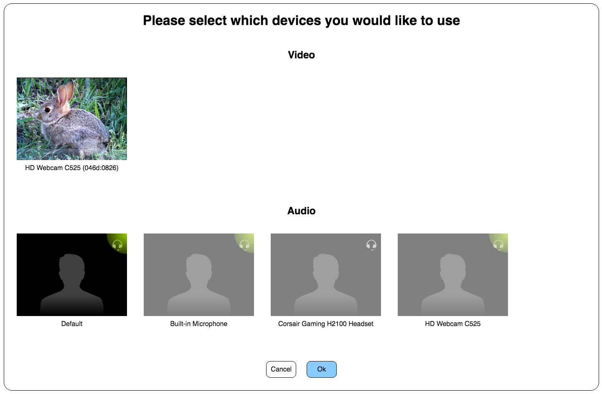

# get-devices-from-ui

```sh
npm install --save git+ssh://git@github.com:voltrevo/get-devices-from-ui.git
```

```js
'use strict';

const getDevicesFromUI = require('get-devices-from-ui');

getDevicesFromUI().then(({audioSource, videoSource}) => {
  OT.initPublisher({audioSource, videoSource});
});
```


